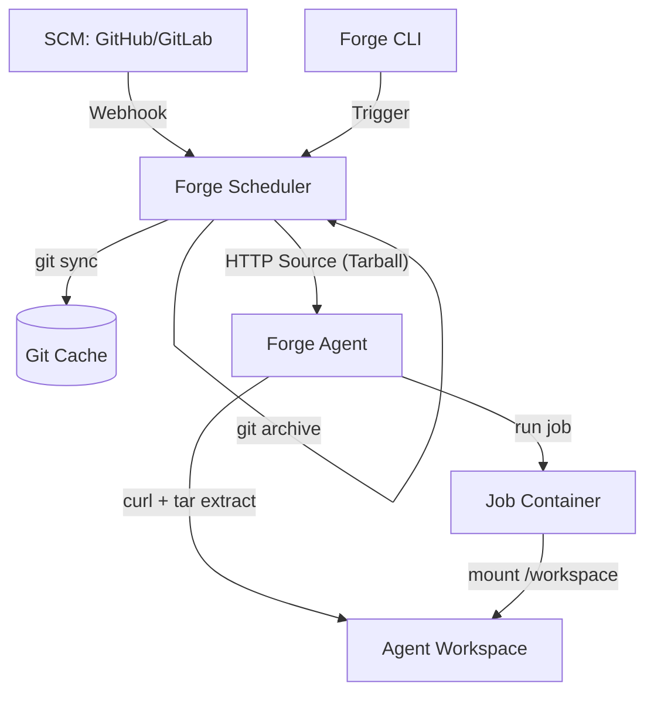

# Requirements

### Overview & Goals
Implement a centralized repository caching mechanism and a workspace distribution system to support distributed Forge environments. This will reduce external network dependency, speed up build times, and enable agents to work in isolated environments.

### Scope
- **In Scope**:
    - Scheduler-managed git repository cache (using bare clones).
    - Source serving endpoint in the scheduler (serving tarballs).
    - Workspace isolation for agents (unique directories per job).
    - CLI command and scheduler endpoint to trigger runs without HMAC (for testing/simulation).
- **Out of Scope**:
    - Multi-tenant cache isolation (beyond project IDs).
    - Persistent workspace caching on agents (workspaces are ephemeral per job).
    - SCM authentication for the agent (handled by the scheduler during cache sync).

### Functional Requirements
- The scheduler shall maintain a bare clone of repositories in a configurable cache directory (`FORGE_GIT_CACHE`).
- The scheduler shall update the cache upon receiving a webhook or a manual trigger.
- The scheduler shall extract the `.forge/pipeline.json` file from the local cache instead of making external network calls.
- The agent shall fetch source code from the scheduler's source endpoint instead of the internet.
- The CLI shall provide a `trigger` command to simulate webhooks easily.
- Forge must work both in the cloud and locally with the same results.

# Technical Design

### Current Implementation
- **Shared Filesystem**: Scheduler and agents currently share `/tmp` via Docker volumes, which is not suitable for a truly distributed system.
- **External Checkout**: The injected `_forge_checkout` step in `internal/scheduler/webhook.go` clones the repository directly from the internet in every run.
- **Pipeline Fetch**: The scheduler fetches the `.forge/pipeline.json` file via HTTP raw CDN calls (GitHub/GitLab) on every webhook.
- **Workspace Collisions**: Agents use a fixed workspace directory defined in `internal/agent/agent.go`, which can cause collisions during parallel runs.

### Key Decisions
- **Scheduler-Managed Cache**: The scheduler will act as the "Source of Truth" and maintain a local git cache in `FORGE_GIT_CACHE`. This allows it to read pipeline files and evaluate policies without external network calls.
- **Network-based Workspace Distribution**: Workspaces will be transferred from the scheduler to agents via a new source serving API, eliminating the need for a shared filesystem between them for source distribution.
- **Tarball Source Format**: For efficiency and simplicity, the scheduler will serve source code as `tar.gz` archives extracted from its git cache using `git archive`.
- **Workspace Isolation**: Agents will create a unique directory for each job (`/tmp/forge-job-{jobID}`) to ensure total isolation.

### Proposed Changes

#### 1. Scheduler Git Cache (`internal/gitcache`)
- New package to manage a directory of bare git clones.
- `type Cache struct { dir string }`
- `Sync(repoURL, token string) error`: Performs `git clone --mirror` or `git remote update`.
- `ReadFile(repoURL, commit, path string) ([]byte, error)`: Uses `git show <commit>:<path>`.
- `WriteArchive(repoURL, commit string, w io.Writer) error`: Uses `git archive --format=tar.gz`.

#### 2. Source Serving API
- **Endpoint**: `GET /api/v1/source/{projectID}?commit={sha}`
- **Handler**: `handleServeSource` in `internal/scheduler/source_handler.go`.
- **Behavior**: Calls `gitcache.WriteArchive` and streams the result.

#### 3. Updated Webhook & Trigger Logic
- **`internal/scheduler/webhook.go`**:
    - `triggerWebhookRun`:
        - Calls `gitcache.Sync`.
        - Fetches `.forge/pipeline.json` via `gitcache.ReadFile`.
        - Injects a `_forge_checkout` step that uses `curl` to fetch the tarball from the scheduler and extracts it.
- **Trigger Endpoint**: `POST /api/v1/projects/{id}/trigger` in `internal/scheduler/server.go`.
    - Accepts `api.ManualTriggerRequest`.
    - Syncs cache, reads pipeline, and triggers run.

#### 4. Agent Isolation
- **`internal/agent/agent.go`**:
    - `execute` will create a unique subdirectory for each job: `filepath.Join(a.workspaceDir, "forge-job-"+spec.JobID)`.
    - The `executor` and `ComputeTaskHash` will use this unique path.

### Architecture Diagram

### File Structure Changes
- `internal/gitcache/cache.go` (New)
- `internal/scheduler/source_handler.go` (New)
- `internal/scheduler/webhook.go` (Modified)
- `internal/scheduler/server.go` (Modified)
- `internal/agent/agent.go` (Modified)
- `internal/api/types.go` (Modified: add `ManualTriggerRequest`)
- `cmd/forge/main.go` (Modified: add `trigger` command)
- `Dockerfile` (Modified: add `git` to runtime stage)
- `compose.yml` (Modified: add `FORGE_GIT_CACHE` env and volume)

# Testing

### Validation Approach
Verification will focus on ensuring the distributed cache is used and that workspaces are correctly isolated without relying on a shared filesystem.

### Key Scenarios
1. **Initial Cache Population**:
    - Trigger a run for a new project.
    - Verify that the scheduler performs a `git clone --mirror` into the cache directory.
    - Verify that the agent successfully fetches and extracts the source.
2. **Subsequent Cache Reuse**:
    - Trigger another run for the same project.
    - Verify (via logs) that the scheduler performs a `git remote update` instead of a full clone.
    - Verify that no external calls are made to GitHub for the pipeline file.
3. **Parallel Job Isolation**:
    - Trigger a pipeline with multiple parallel steps.
    - Verify that the agent creates separate directories for each step and that they don't interfere.
4. **Manual Trigger Simulation**:
    - Use `forge trigger <projectID> --branch main` to start a run.
    - Verify the run appears in the UI and executes correctly.

### Edge Cases
- **Missing Commit**: Verify appropriate error handling if a commit SHA is not found in the cache.
- **Cache Corruption**: Verify that the system can recover if a bare clone in the cache is invalid.
- **Concurrent Cache Access**: Ensure the scheduler handles concurrent webhook arrivals for the same project safely.

# Delivery Steps

###   Step 1: Implement Scheduler Git Cache and Source Serving
Implement a new `internal/gitcache` package and add a source serving endpoint to the scheduler.
- Create `internal/gitcache/cache.go` to handle `git clone --mirror` and `git archive`.
- Add `GET /api/v1/source/{projectID}` to `internal/scheduler/server.go` to serve repo tarballs.
- Update `Dockerfile` to include `git` in the runtime stage.
- Add `git_cache` volume to `compose.yml` and mount it to the scheduler.

###   Step 2: Update Webhook Logic and Policy Evaluation
Modify the scheduler to use the local git cache for all incoming webhooks.
- Update `internal/scheduler/webhook.go` to fetch `.forge/pipeline.json` from the local cache instead of via HTTP.
- Ensure the scheduler updates the cache before evaluating policies.
- Update policy evaluation to use a local temp workspace populated from the cache.

###   Step 3: Implement Agent Workspace Isolation and Source Fetching
Enable agents to run in isolated workspaces and fetch source code from the scheduler.
- Update `internal/agent/agent.go` to create a unique workspace directory for each job.
- Modify the injected `_forge_checkout` step in the scheduler to use `curl` to fetch the source tarball from the scheduler instead of `git clone`.
- Ensure the agent correctly populates its local workspace before executing job steps.

###   Step 4: Add Webhook Simulation (Trigger) Command and Endpoint
Add a CLI command and a scheduler endpoint for easy manual triggering of pipelines.
- Implement `POST /api/v1/projects/{id}/trigger` in the scheduler (requires Forge token auth).
- Add a `forge trigger <projectID>` command to `cmd/forge/main.go`.
- Verify the entire flow by triggering a run and observing the internal cache usage and agent source fetching.