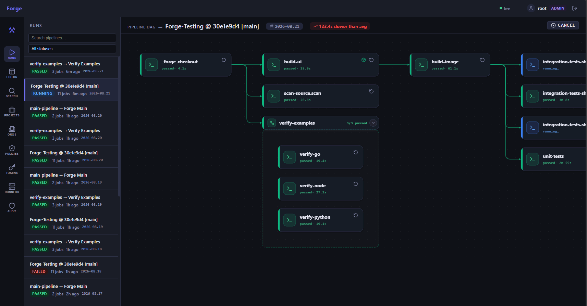
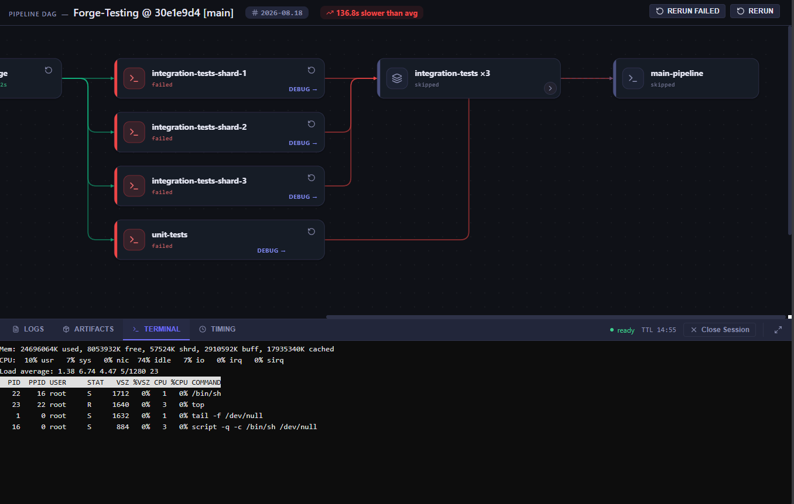
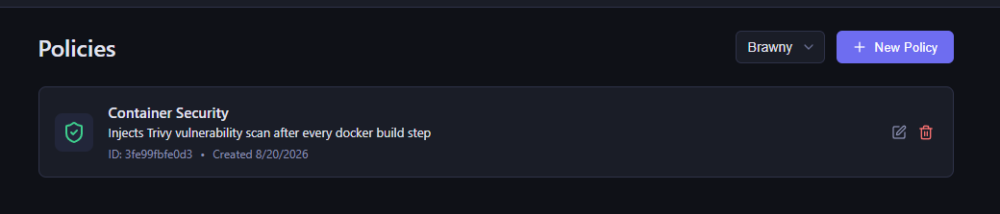
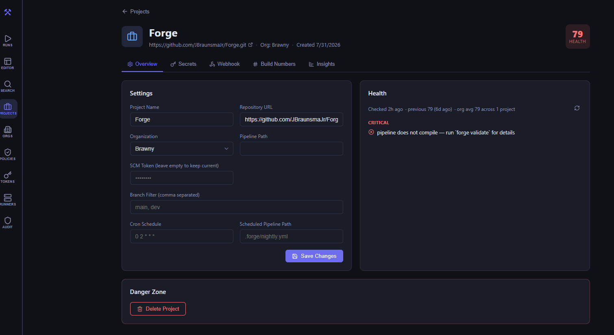
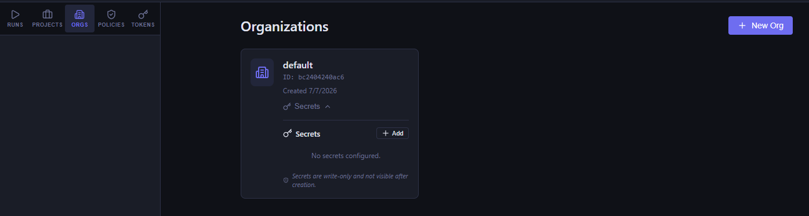
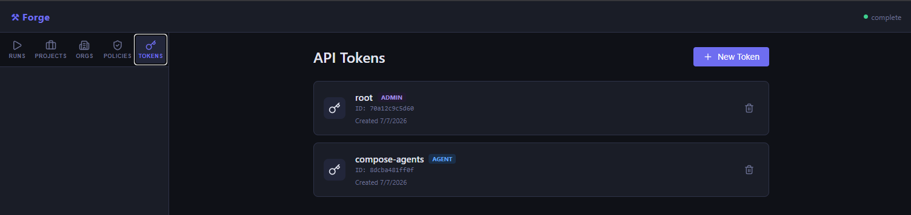

# Forge CI/CD

**A code-first CI/CD pipeline runner that keeps logic in your codebase, not in YAML strings.**

[](https://www.gnu.org/licenses/agpl-3.0)
[](https://go.dev)
[](https://docs.docker.com/get-docker/)

---



## The Problem with Existing CI/CD Systems

Every team eventually hits the same wall with GitHub Actions, GitLab CI, and CircleCI:

| Pain point                  | What teams end up doing                                       |
|-----------------------------|---------------------------------------------------------------|
| Complex build matrices      | Hundreds of lines of static YAML, `include`/`exclude` hacks   |
| Shared pipeline logic       | Copy-paste across repos, or reusable workflow limitations     |
| Monorepo change detection   | Separate workflow per service, or build everything every time |
| Multi-environment deploys   | Duplicate deploy YAML for staging/prod, or `if:` spaghetti    |
| Cross-team dependencies     | Webhook chains, polling, no unified visibility                |
| Business logic in pipelines | Shell scripts embedded as YAML strings with no IDE support    |

Forge is built around one principle: **pipeline logic belongs in source code, not YAML.**

---

## What Makes Forge Different

### Scripts live in your repo, not in YAML strings

```yaml
# Other systems force you to write this:
- name: Detect changed services
  run: |
    CHANGED=$(git diff --name-only HEAD~1 | grep "^services/" | ...)
    for svc in $CHANGED; do
      # 80 more lines of shell embedded in YAML
    done

# Forge lets you write this:
- id: detect-changes
  type: generator
  image: python:3.12-slim
  script: scripts/ci/detect_changes.py  # a real Python file in your repo
```

Your CI scripts get syntax highlighting, IDE support, independent testing, and proper version control diffs — not a wall of escaped YAML.

### Generator steps create jobs at runtime

No other CI system has this. A generator step runs code and emits new step definitions as JSON. Want to build for every platform listed in `platforms.json`? Write a Python script that reads it. New platform added? The pipeline adapts automatically — no YAML changes.

```yaml
- id: matrix-generator
  type: generator
  image: python:3.12-slim
  script: scripts/ci/generate_matrix.py   # reads platforms.json, emits steps
```

### Pipeline chaining with artifact handoff

One pipeline can trigger another, pass artifacts into it, and wait for results. Deploy logic lives in one file and is called from everywhere — no copy-paste, no reusable workflow limitations.

```yaml
- id: deploy-staging
  type: pipeline
  pipeline: .forge/deploy.yml   # calls your reusable deploy pipeline
  wait: true
  variables:
    ENVIRONMENT: staging
  artifacts_send: [build-output]
  artifacts_receive: [deployed-endpoint]
```

### Debug failing jobs with a real terminal



When a job fails, open a live terminal session directly into the container in the exact failing environment. No guessing from logs — just `cd` into the workspace and investigate.

### Manual Approvals & Gates

A step with `type: approval` will pause the pipeline and wait for a user to click "Approve" in the Web UI before downstream dependencies are unlocked. Perfect for production deployment gates.

### Release Artifacts to GitHub/GitLab

Push binaries and assets directly to your SCM provider's release pages. Forge handles the authentication, asset upload, and release creation automatically.

```yaml
- id: github-release
  type: release
  depends_on: [build-binaries]
  condition: tag()
  release:
    name: "Release ${{ env.FORGE_COMMIT_TAG }}"
    tag: "${{ env.FORGE_COMMIT_TAG }}"
    artifacts: [forge-*]
```

### Runner Health Dashboard

Monitor your self-hosted infrastructure in real time. See agent status, job concurrency, and Docker metrics from a centralized view.

### Policy injection for security at scale

Define security policies (Trivy scans, govulncheck, etc.) at the org level. They inject automatically into every pipeline without pipeline authors knowing. Change a policy in one place, it applies everywhere.



---

## Architecture

```
┌─────────────┐    ┌─────────────┐    ┌──────────────┐
│  forge CLI  │    │  Web UI     │    │  GitHub/     │
│  (submit,   │    │  (DAG view, │    │  GitLab      │
│   status)   │    │   logs,     │    │  Webhooks    │
└──────┬──────┘    │   debug)    │    └──────┬───────┘
       │           └──────┬──────┘           │
       └──────────────────▼──────────────────┘
                   ┌──────────────┐
                   │  Scheduler   │  :8080
                   │              │
                   │ ┌──────────┐ │
                   │ │ Policy   │ │  injects steps at submit time
                   │ │ Engine   │ │
                   │ └──────────┘ │
                   └──────┬───────┘
          ┌───────────────┼───────────────┐
          │               │               │
    ┌─────▼─────┐   ┌─────▼─────┐   ┌────▼──────┐
    │ PostgreSQL│   │   Vault    │   │  MinIO/S3 │
    │ (job queue│   │ (secrets)  │   │(artifacts)│
    │  + state) │   └───────────┘   └───────────┘
    └───────────┘
          ▲
          │  lease / heartbeat / complete
    ┌─────┴──────────────────────────┐
    │                                │
┌───┴──────┐              ┌──────────┴──┐
│  Agent 1  │              │   Agent 2   │
│          │              │             │
│          │              │             │
│docker run│              │ docker run  │
└──────────┘              └─────────────┘
```

The **scheduler** accepts pipeline submissions, applies org policies, stores jobs in PostgreSQL, and serves the Web UI. **Agents** poll the scheduler, lease jobs, execute them in Docker containers, stream logs back in real time, and upload/download artifacts to S3-compatible storage. All traffic, including live debug terminals, is routed through the scheduler.

---

## Installation

### CLI Binary

Install the Forge CLI on Linux, macOS, or Windows using the one-liner scripts:

**Linux / macOS:**
```bash
curl -sSL https://forge.dev/install.sh | bash
```

**Windows (PowerShell):**
```powershell
iwr -useb https://forge.dev/install.ps1 | iex
```

### Self-Hosted Core (Docker)

Deploy the Forge scheduler and core services (Postgres, Vault, MinIO) to your own server:

```bash
curl -sSL https://forge.dev/deploy.sh | bash
```

This will create a `forge-server` directory, generate secure tokens, and launch the stack using Docker Compose.

---

## Quick Start (5 minutes)

### Prerequisites

- [Go 1.22+](https://go.dev/dl/)
- [Docker Desktop](https://docs.docker.com/get-docker/) or Docker Engine

### Option A: Local run (no infrastructure needed)

```bash
git clone https://github.com/JBraunsmaJr/forge
cd forge

# 1. Build the Web UI
cd ui && npm install && npm run build
cd ..

# 2. Build the Go binary
go build -o forge ./cmd/forge      # Linux/Mac
# go build -o forge.exe ./cmd/forge  # Windows

# Alternatively, use the Makefile:
# make build

# 3. Run a pipeline directly on your machine
./forge run examples/docker-ci.json
```

This runs the pipeline locally using your machine's Docker daemon. No scheduler, no database. Perfect for development.

### Option B: Full distributed stack (recommended for teams)

```bash
# Start the complete stack: scheduler, 2 agents, postgres, vault, minio
cp .env.example .env
docker compose up --build -d

# Watch the initialization (creates default org, policies, and tokens)
docker compose logs -f init
```

### Option C: Observability (Metrics & Tracing)

Forge includes built-in support for Prometheus metrics and OpenTelemetry tracing.

```bash
# Start the stack with Prometheus and Grafana
docker compose -f compose.yml -f compose.metrics.yml up -d
```

- **Prometheus**: `http://localhost:9090` (Scrapes scheduler `/metrics`)
- **Grafana**: `http://localhost:3000` (Pre-configured with Prometheus datasource)
- **Tracing**: OpenTelemetry spans are emitted to `stdout` by default for both scheduler and agents.

After init completes, the terminal shows:

```
── Ready ──────────────────────────────────────
  Web UI      http://localhost:8080
  Vault UI    http://localhost:8200
  MinIO UI    http://localhost:9001

  $env:FORGE_API_TOKEN = 'forge-dev-admin-token'
  $env:FORGE_ORG       = 'abc123def456'
```

Open the Web UI, enter your token when prompted, and submit your first pipeline:

```powershell
$env:FORGE_API_TOKEN = 'forge-dev-admin-token'
$env:FORGE_ORG       = 'abc123def456'

.\forge.exe submit examples/docker-ci.json
```

Watch the DAG render in real time as jobs execute. Click any node to see its live log stream. Click "Debug →" on a failed job to open a terminal directly in the container.

---

## Writing Your First Pipeline

Forge pipelines are YAML or JSON files, typically stored at `.forge/pipeline.yml` in your repo.

```yaml
name: my-first-pipeline

steps:
  - id: test
    image: golang:1.26-alpine
    run: go test ./...

  - id: build
    image: golang:1.26-alpine
    depends_on: [test]
    run: go build -o dist/myapp ./cmd/myapp
    artifacts:
      upload:
        - path: dist/myapp
          name: app-binary

  - id: containerize
    image: docker:27-cli
    docker_socket: true        # mount host Docker socket
    depends_on: [build]
    artifacts:
      download:
        - name: app-binary
          dest: dist/myapp
    run: |
      chmod +x dist/myapp
      docker build -t myapp:latest .
```

See the [Pipeline Reference](docs/pipeline-reference.md) for the complete field list, or the [Examples Guide](docs/examples.md) for real-world patterns.

---

## Documentation

| Guide                                                      | Description                                                         |
|------------------------------------------------------------|---------------------------------------------------------------------|
| [Getting Started](docs/getting-started.md)                 | Full setup for local, single-machine, and team deployments          |
| [Pipeline Reference](docs/pipeline-reference.md)           | Every pipeline field documented with examples                       |
| [Examples Guide](docs/examples.md)                         | Dynamic matrices, monorepos, pipeline chaining, progressive deploys |
| [Secrets Management](docs/secrets.md)                      | Vault integration with project/org/global scoping                   |
| [Artifact Storage](docs/configuration.md#artifact-storage) | Local filesystem and S3-compatible backends                         |
| [Policy Engine](docs/policies.md)                          | Org-wide security injection                                         |
| [Debug Sessions](docs/debugging.md)                        | Live terminal in failing job containers                             |
| [CLI Reference](docs/cli-reference.md)                     | All commands and flags                                              |
| [Configuration](docs/configuration.md)                     | Environment variables reference                                     |
| [HTTPS / Proxy](docs/HTTPS.md)                             | Enabling TLS with Caddy, Cloudflare, or custom proxies              |
| [Architecture](docs/architecture.md)                       | How Forge works under the hood                                      |

---

## Comparison

| Feature                             | GitHub Actions                  | GitLab CI                 | Forge                          |
|-------------------------------------|---------------------------------|---------------------------|--------------------------------|
| Pipeline logic in source files      | ❌ YAML strings                  | ❌ YAML strings            | ✅ `script:` field              |
| Runtime job generation              | ❌ Static matrix only            | ❌ Static matrix only      | ✅ Generator steps              |
| Matrix builds (built-in)            | ✅                               | ✅                         | ✅                              |
| Pipeline templates (`uses:`)        | ⚠️ Reusable workflows (limited) | ✅ `extends:` / `include:` | ✅ Reusable steps               |
| Pipeline chaining                   | ⚠️ Reusable workflows (limited) | ⚠️ `trigger:` (limited)   | ✅ First-class `type: pipeline` |
| Artifact handoff between pipelines  | ❌                               | ❌                         | ✅                              |
| Manual Approvals                    | ✅ Environments                  | ✅                         | ✅ `type: approval`             |
| Scheduled Pipelines                 | ✅ `on: schedule`                | ✅                         | ✅ Project-level Cron           |
| Release Artifacts to SCM            | ❌ Action required               | ❌ Action required         | ✅ `type: release`              |
| Debug failing jobs                  | ❌ Re-run and add echo           | ❌                         | ✅ Live terminal                |
| Timing-based test splitting         | ❌ Third-party actions           | ⚠️ `parallel:` (manual)   | ✅ `split:` + timing history    |
| Policy injection                    | ❌                               | ❌                         | ✅ Org-level policies           |
| Scoped secrets (project/org/global) | ❌                               | ⚠️ Group variables        | ✅                              |
| Self-hosted                         | ✅ Runners                       | ✅ Runners                 | ✅ Full stack                   |
| Open source                         | ❌                               | ✅                         | ✅ AGPL-3.0                     |

---

## License

Forge is licensed under the [GNU Affero General Public License v3.0](LICENSE).





