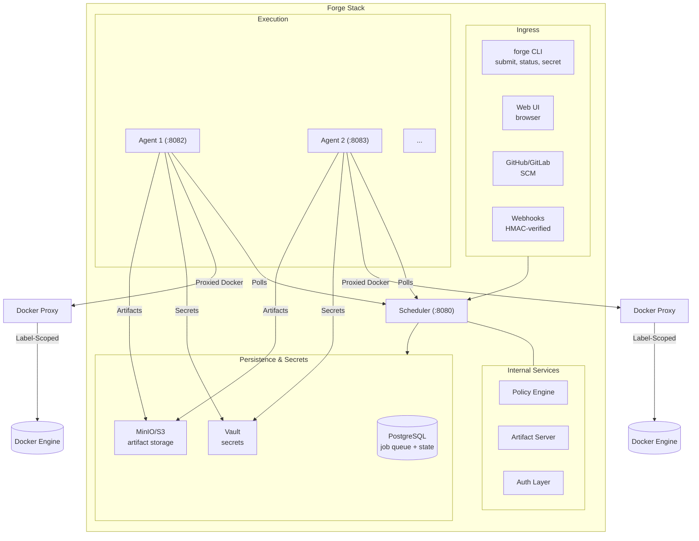

# Architecture

This document describes how Forge works under the hood — useful for operators deploying Forge and contributors working on the codebase.

---

## Components



---

## The Scheduler

The scheduler is a single HTTP server that:

**Accepts pipeline submissions** — compiles the pipeline, applies org policies, stores jobs in PostgreSQL, and returns a run ID.

**Drives the job queue** — exposes `/api/v1/jobs/lease` for agents to poll. Uses `SELECT FOR UPDATE SKIP LOCKED` in PostgreSQL to ensure each job is claimed by exactly one agent, even with many concurrent agents.

**Broadcasts real-time updates** — uses Server-Sent Events (SSE) to push run status and live log lines to browsers.

**Serves the Web UI** — the React-like UI is embedded in the binary via `//go:embed`.

**Runs policy transformers** — when a pipeline is submitted under an org that has transformer policies, the scheduler runs Docker containers that receive the pipeline on stdin and return a modified pipeline on stdout.

**Issues OIDC tokens** — for every job run, the scheduler issues a short-lived (1h) RS256-signed JWT that steps can use to authenticate with external services (GitHub, Cloud providers). The public keys are served via a standard JWKS endpoint.

**Maintains Audit Logs** — captures an append-only log of all security-critical operations, including run triggers, policy applications, secret changes, and authentication failures.

### Why PostgreSQL for a job queue?

The critical query is:

```sql
WITH next AS (
    SELECT id FROM jobs
    WHERE  status = 'queued'
    LIMIT  1
    FOR UPDATE SKIP LOCKED
)
UPDATE jobs
SET    status = 'running', lease_id = $1, agent_id = $2 ...
FROM   next WHERE jobs.id = next.id
RETURNING jobs.id, jobs.run_id, ...
```

`SKIP LOCKED` means: "give me a row that nobody else has locked right now." Two agents calling this simultaneously each get a different job — no double-assignment, no external lock manager needed. This is the same technique used by Sidekiq, Celery, and Que.

---

## The Agent

Agents are stateless workers. For security, agents are typically deployed alongside a **Forge Proxy** which intercepts all Docker socket communication.

Each agent:

1. Registers with the local Proxy to receive a unique, label-enforcing Unix socket
2. Polls the scheduler for the next queued job
3. Executes the job in a Docker container through the Proxy
4. Joins the Docker network specified by `FORGE_DOCKER_NETWORK` to ensure connectivity to the scheduler/artifact store if they are in the same Docker ecosystem.
5. Streams log output back to the scheduler in real-time batches
6. Downloads and uploads artifacts via pre-signed URLs
7. Heartbeats every 10 seconds to prove it's still alive
8. Reports completion with exit code and final log set

### Docker Isolation & Security (Alpha-Hardening)

To prevent an agent or a job from interfering with other jobs or the host system, Forge implements multi-layer Docker isolation:

- **Label Stamping**: Every container, network, and volume created by Forge is automatically stamped with `forge.managed=true`, `forge.agent_id`, `forge.run_id`, and `forge.job_id`.
- **Socket Proxying**: The Forge Proxy intercepts all Docker API calls. It ensures that an agent can only see and interact with resources that carry its own `forge.agent_id`. This prevents `docker rm -f $(docker ps -aq)` from destroying the entire CI stack.
- **Scoped Pruning**: Agents perform cleanup using these same labels, ensuring they only prune their own stale resources.

### Heartbeat and failure recovery

If an agent crashes mid-job, the scheduler detects the missing heartbeat after 30 seconds and resets the job to `queued` for another agent to claim.

---

## A Pipeline Run, Step by Step

```
1. User runs: forge submit .forge/pipeline.yml

2. CLI reads the pipeline file, compiles it to StepDef list,
   sends POST /api/v1/runs to scheduler.

3. Scheduler applies org policies:
   - Static policies inject additional steps
   - Transformer policies run a Docker container that receives the
     full pipeline on stdin and returns a modified pipeline on stdout

4. Scheduler stores one row per step in the jobs table.
   Steps with no depends_on start as 'queued'.
   All others start as 'pending'.

5. Agent polls: POST /api/v1/jobs/lease
   Scheduler finds the first 'queued' job via SELECT FOR UPDATE SKIP LOCKED.
   Job row transitions: queued → running.
   Scheduler returns JobSpec (image, command, env, secret names, etc.)

6. Agent fetches secrets from Vault by name (never stored in scheduler DB).

7. Agent downloads any declared artifact dependencies from S3/local store.

8. Agent runs the container:
   docker run --rm --workdir /workspace
              --volume workspaceDir:/workspace:rw
              --env KEY=VALUE ...
              image command...

9. Agent reads Docker stdout/stderr line by line.
   Every 500ms (or 50 lines), it POSTs a batch to scheduler:
   POST /api/v1/jobs/{id}/logs

10. Scheduler broadcasts each log batch to SSE subscribers (browsers).
    Browser appends lines to the log panel in real time.

11. Container exits. Agent reads the full JSONL log file.

12. Agent uploads declared artifacts to S3/local store.

13. Agent reports completion:
    POST /api/v1/jobs/{id}/complete  { exit_code, duration_ms, log_events }

14. Scheduler updates job status: passed or failed.
    Scheduler checks if any 'pending' jobs now have all dependencies met.
    If yes, those jobs transition to 'queued'.

15. Repeat from step 5 for the next queued job.

16. When all jobs reach a terminal state, the run status is computed:
    passed (all jobs passed) or failed (any job failed).
```

---

## Artifact Storage

The artifact system uses a pre-signed URL pattern to avoid making the scheduler a bandwidth bottleneck for large files.

```
Agent upload flow:
  1. POST /api/v1/artifacts/presign → {artifact_id, upload_url}
  2. PUT <upload_url>  (direct to scheduler for local backend, direct to S3 for S3 backend)
  3. POST /api/v1/artifacts/{id}/confirm

Agent download flow:
  1. GET /api/v1/artifacts?run_id=X&name=Y → {download_url}
  2. GET <download_url>  (direct from scheduler or S3)
```

For the **local backend**, upload/download URLs point back to the scheduler. For the **S3 backend**, URLs are pre-signed S3 URLs valid for 1 hour — data never touches the scheduler.

---

## Secret Scoping

Secrets are stored in Vault, never in PostgreSQL. The Vault path hierarchy:

```
secret/data/forge/projects/{project_id}/{NAME}   ← highest priority
secret/data/forge/orgs/{org_id}/{NAME}
secret/data/forge/global/{NAME}
secret/data/forge/{NAME}
```

The agent receives the `org_id` and `project_id` of the run in the JobSpec, then calls `GetScoped(name, orgID, projectID)` which walks the chain and returns the first match. A project-level secret overrides an org-level secret of the same name, which overrides a global one.

---

## Policy Engine

When a pipeline is submitted under an org, the scheduler runs all transformer policies registered for that org before the jobs are stored.

Each transformer receives a JSON object on stdin:

```json
{
  "pipeline_name": "my-pipeline",
  "steps": [ ... ],
  "workspace_dir": "/workspace",
  "org_id": "abc123"
}
```

And returns a JSON array of steps on stdout — the complete modified step list. The transformer can add, remove, or reorder steps and modify dependencies.

Example built-in transformers (in `examples/policies/`):
- `container-security.py` — injects Trivy vulnerability scan after every docker build step
- `language-security.py` — injects govulncheck for Go repos, npm audit for Node repos, etc.

Policies with `forbid_override: true` cause the submission to be rejected with HTTP 403 if the transformer attempts a prohibited modification.

---

## WebSocket Debug Terminal

When a debug session is created, the agent starts a container and bridges its PTY to the scheduler.

1.  Browser connects to `WS /api/v1/debug/{id}/ws` on the **scheduler**.
2.  Scheduler proxies the connection to the **agent** through the existing gRPC session or an internal HTTP/2 connection.
3.  Agent runs `docker exec` with a PTY:
    ```
    script -q -c 'exec env TERM=xterm-256color COLUMNS=220 LINES=50 sh' /dev/null || exec sh -i
    ```
4.  Bytes flow: Browser ↔ Scheduler ↔ Agent ↔ Container.

The browser uses xterm.js to render the terminal, including full ANSI escape code support. By routing all traffic through the scheduler, Forge supports HTTPS and secure authentication without complex agent-side network configuration.

---

## Database Schema

```
runs
  id, name, workspace_dir, org_id, project_id, created_at

jobs
  id, run_id, step_id, step_type, image, command, work_dir,
  env, inputs, timeout_ns, depends_on, secret_names, policy_source,
  condition, always_run, pipeline_ref, emitted_step_ids,
  status, lease_id, agent_id, leased_at, heartbeat_at,
  exit_code, duration_ms, started_at, finished_at

job_logs
  id (serial), job_id, ts, level, message

orgs
  id, name, created_at

policies
  id, org_id, name, description, steps, transformer, forbid_override, created_at

api_tokens
  id, token_hash (SHA-256), name, role, created_at

projects
  id, org_id, name, repo_url, pipeline_path, cron, scheduled_pipeline_path,
  branch_filter, webhook_secret, scm_token, created_at

artifacts
  id, run_id, job_id, name, filename, size_bytes, content_type,
  storage_key, upload_token, confirmed, created_at
```