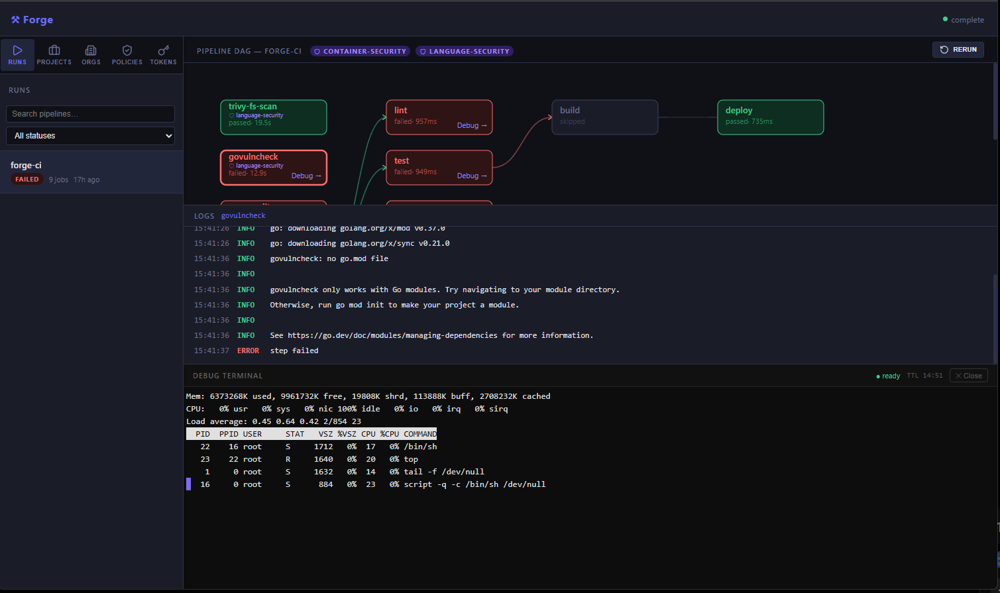

# Debug Sessions

One of Forge's most powerful features: when a job fails, you can open a live terminal session directly into the container in the exact environment where the failure occurred. No more guessing from log output.

---

## How It Works

1. Click "Debug →" on any failed (or running) job in the Web UI
2. The scheduler creates a debug session and requests an agent to start a container
3. The container uses the same image and workspace as the failing job
4. Your browser connects directly to the agent's WebSocket server
5. A full interactive terminal appears, powered by xterm.js — colors, tab completion, arrow keys, everything

The terminal is connected to the container via `script`, which allocates a real PTY inside the Linux container. This works regardless of your operating system because the PTY is in the container's kernel, not the host.

---

## Using Debug Sessions

### Opening a Session

In the Web UI, click **"Debug →"** on any job node. The panel slides in at the bottom of the screen.

The session status transitions:
- **● starting container…** — agent is creating the container
- **● ready** — terminal is live, type away

### What You Can Do

The workspace from the failing job is mounted at `/workspace`. Everything that was present when the job ran is still there — source files, partial build outputs, downloaded dependencies.

```bash
# Navigate to the workspace
cd /workspace

# Check what files exist
ls -la

# Re-run the failing command
go test ./... -v

# Inspect environment variables
env | sort

# Check if a secret was injected correctly
echo $MY_SECRET

# Look at build artifacts
ls -lh dist/

# Run a debugger
dlv debug ./cmd/myapp
```



### TTL and Timeout

Sessions expire after 15 minutes of inactivity (configurable). The TTL countdown is shown in the terminal header. Each command you run resets the countdown.

### Closing a Session

Click **✕ Close** to end the session. The container is immediately stopped and removed.

---

## What the Terminal Gives You

Since `script` allocates a proper PTY inside the container, you get the full interactive experience:

| Feature                               | Works? |
|---------------------------------------|--------|
| Colors and ANSI escape codes          | ✅      |
| Tab completion                        | ✅      |
| Arrow keys / command history          | ✅      |
| Interactive programs (vim, htop, top) | ✅      |
| Ctrl+C to interrupt a running command | ✅      |
| Multiple commands without re-running  | ✅      |
| Background jobs (`&`)                 | ✅      |

---

## Agent WebSocket Configuration

Debug terminals require the browser to connect directly to the agent's WebSocket server (the scheduler is not in the data path). Configure `FORGE_AGENT_WS_ADDR` on each agent to the address that browsers will use to reach it.

```bash
# Local development (browser and agent on same machine)
FORGE_AGENT_WS_ADDR=localhost:8082

# Remote (agent on a different machine)
FORGE_AGENT_WS_ADDR=192.168.1.100:8082

# Docker Compose (set FORGE_AGENT_HOST in .env)
FORGE_AGENT_HOST=192.168.1.100
```

In the compose stack, agent-1 uses port 8082 and agent-2 uses port 8083. Both are published to the host.

---

## Security Considerations

Debug terminals are authenticated via your API token, included in the WebSocket URL. The agent's WebSocket server currently accepts connections with a valid token.

For production environments:
- Ensure your API tokens are treated as secrets
- Consider network segmentation so only authorized users can reach agent ports
- Token-based auth for the WebSocket is implemented and validated