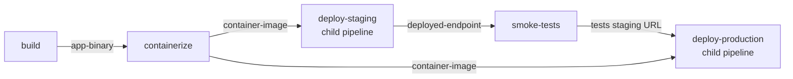

# Example Pipelines

These examples demonstrate patterns that are difficult or impossible in traditional YAML-based CI/CD systems. Each example is annotated with what it does and why it works the way it does.

All examples are in `examples/.forge/`. The CI scripts they reference are in `examples/scripts/ci/`.

---

## Example 1: Dynamic Matrix Build

**File:** `examples/.forge/dynamic-matrix.yml`  
**Script:** `examples/scripts/ci/generate-matrix.py`

### What it does

Generates one build job and one test job per target platform at runtime, based on a config file. All jobs run in parallel. A release step fans in after everything passes.

### Why it's different from GitHub Actions

GitHub Actions matrix values must be declared in YAML before the workflow runs:

```yaml
# GitHub Actions — static, must be updated manually
strategy:
  matrix:
    os: [linux, windows, darwin]
    arch: [amd64, arm64]
    exclude:
      - os: windows
        arch: arm64
```

In Forge, the generator script reads `platforms.json` at runtime:

```yaml
- id: matrix-generator
  type: generator
  image: python:3.12-slim
  script: examples/scripts/ci/generate-matrix.py
```

Add a new platform to `platforms.json` → pipeline adapts. Set `SKIP_WINDOWS=1` → Windows builds are skipped for that run. Neither requires editing YAML.

### The generator script

`generate-matrix.py` reads `platforms.json` (or uses defaults), then emits one build step + one test step per platform:

```python
def steps_for_platform(p: dict) -> list[dict]:
    build_step = {
        "id":    f"build-{p['os']}-{p['arch']}",
        "image": p["image"],
        "env":   {"GOOS": p["os"], "GOARCH": p["arch"]},
        "run":   f"go build -o dist/myapp-{p['os']}-{p['arch']} ./cmd/myapp",
        "artifacts": {"upload": [{"path": f"dist/myapp-{p['os']}-{p['arch']}"}]}
    }
    # test step runs in parallel (no dependency on build step)
    test_step = { ... }
    return [build_step, test_step]
```

The fan-in point — `depends_on: [matrix-generator]` on the release step — means "wait for the generator AND all of its emitted children." Forge resolves this automatically.

### platforms.json

```json
[
  {"os": "linux",   "arch": "amd64",  "image": "golang:1.24-alpine"},
  {"os": "linux",   "arch": "arm64",  "image": "golang:1.24-alpine"},
  {"os": "windows", "arch": "amd64",  "image": "golang:1.24-alpine"},
  {"os": "darwin",  "arch": "amd64",  "image": "golang:1.24-alpine"},
  {"os": "darwin",  "arch": "arm64",  "image": "golang:1.24-alpine"}
]
```

---

## Example 2: Monorepo Smart CI

**File:** `examples/.forge/monorepo-smart-ci.yml`  
**Script:** `examples/scripts/ci/detect-changes.py`

### What it does

Detects which services in a monorepo have changed files, and runs lint + test + build + push for only those services. Unchanged services produce zero jobs. If `shared/` changes, all services are rebuilt.

### Why it's different

Traditional approaches:
- **Option A:** Build everything — slow for large monorepos, wastes resources
- **Option B:** Per-service `paths:` filters — separate workflow file per service, adding a service means adding a workflow, hard to maintain
- **Option C:** GitHub's `dorny/paths-filter` action + dynamic matrix — requires experimental features, limited output format

Forge approach — one generator step, one script:

```yaml
- id: change-detector
  type: generator
  image: python:3.12-slim
  script: examples/scripts/ci/detect-changes.py
  env:
    REGISTRY: registry.example.com
    BASE_REF: "${BASE_REF:-HEAD~1}"
```

### The change detection script

```python
def main():
    changed_paths = git_changed_paths(BASE_REF)
    
    # If shared/ changed, rebuild everything
    if any(p.startswith("shared/") for p in changed_paths):
        affected = discover_services()  # all services
    else:
        affected = [svc for svc in discover_services()
                    if any(p.startswith(f"services/{svc}/") for p in changed_paths)]
    
    steps = []
    for svc in affected:
        steps.extend(build_steps_for_service(svc))
    
    print(json.dumps(steps))
```

Each service gets exactly four steps with correct dependencies:

```
lint-auth-service  ─────┐
                        ├──► build-auth-service ──► push-auth-service
test-auth-service  ─────┘
```

All services run fully in parallel with each other.

### Adding a new service

Add a directory under `services/`. No pipeline changes needed — the detector script discovers services dynamically.

---

## Example 3: Progressive Deployment with Pipeline Chaining

**Files:** `examples/.forge/progressive-deploy.yml`, `examples/.forge/deploy.yml`

### What it does

Builds a Go application, containerizes it, deploys to staging (child pipeline), runs integration tests against staging, then deploys to production (same child pipeline, different variables). Artifacts flow between parent and child pipelines.

### The key insight: one deploy file, used everywhere

The deploy logic lives in `.forge/deploy.yml`. It's called three times — once for staging, once for canary, once for production — with different variables injected each time:

```yaml
# In progressive-deploy.yml
- id: deploy-staging
  type: pipeline
  pipeline: .forge/deploy.yml
  variables:
    ENVIRONMENT: staging
    NAMESPACE: myapp-staging
    REPLICAS: "2"
  artifacts_send: [container-image]     # pass the built image
  artifacts_receive: [deployed-endpoint] # get back the URL

- id: deploy-production
  type: pipeline
  pipeline: .forge/deploy.yml
  depends_on: [smoke-tests]             # only runs if tests pass
  variables:
    ENVIRONMENT: production
    NAMESPACE: myapp-production
    REPLICAS: "10"
  artifacts_send: [container-image]     # same image, different target
```

### Artifact flow



### The child deploy pipeline

`deploy.yml` is a standalone pipeline that:
1. Loads the container image from the artifact store
2. Pushes it to the container registry
3. Deploys via Helm
4. Returns the deployed endpoint URL as an artifact

It has no hardcoded environment names — all configuration comes from injected `variables`.

### In GitHub Actions

This pattern requires:
- `workflow_call:` with `inputs:` and `outputs:` declarations for each variable
- Separate `artifacts:` upload/download steps in every workflow
- Manual output mapping between caller and called workflow
- No way to pass binary artifacts between workflows at all

---

## Example 4: Cross-Team Library Release

**File:** `examples/.forge/library-release.yml`  
**Script:** `examples/scripts/ci/discover-consumers.py`

### What it does

When a library is released:
1. Tests and packages the library
2. A generator step (Python script) discovers which consumer services depend on it
3. Triggers each consumer's integration test suite in parallel as child pipelines
4. Only publishes if ALL consumer tests pass
5. Notifies the team

### Why it's hard in traditional CI

To trigger downstream repos in GitHub Actions, you need:
- `repository_dispatch` events or `workflow_dispatch` triggers in each consumer repo
- Each consumer team must maintain their workflow to watch for your event
- No unified view of all downstream results
- You don't know if downstream tests passed before you publish

In Forge, Team A's pipeline owns the whole flow:

```yaml
- id: discover-consumers
  type: generator
  image: python:3.12-slim
  script: examples/scripts/ci/discover-consumers.py

- id: publish
  depends_on: [discover-consumers]   # waits for ALL consumer tests
```

### The consumer registry

`discover-consumers.py` reads `.forge/consumer-registry.json`:

```json
[
  {"name": "auth-service",    "team": "platform",      "pipeline": ".forge/integration-test.yml"},
  {"name": "api-gateway",     "team": "api",           "pipeline": ".forge/integration-test.yml"},
  {"name": "notification-svc","team": "notifications", "pipeline": ".forge/integration-test.yml"}
]
```

Adding a new consumer: add an entry to `consumer-registry.json`. The library team doesn't need to edit their release pipeline.

### The generated child pipeline steps

Each consumer gets a `type: pipeline` step that:
- Triggers their integration test pipeline
- Passes the library archive artifact
- Passes the library version and parent run ID as variables
- Waits for the test pipeline to complete

All consumers run in parallel — maximum fan-out, fan back in before publish.

---

## Example 5: Conditional Logic and Event Triggers

**File:** `examples/.forge/conditionals.yml`

### What it does

Showcases Forge's conditional execution engine. Steps can be configured to run only on success, only on failure, or always, regardless of dependency status. It also demonstrates how to handle PR/MR-specific logic using environment variables.

### Why it's different

In GitHub Actions, conditional logic is often buried in complex `if:` expressions:

```yaml
# GitHub Actions — complex expressions in YAML
if: ${{ always() && (needs.setup.result == 'failure' || needs.test.result == 'failure') }}
```

Forge uses simple, readable function calls and a dedicated `always_run` flag:

```yaml
- id: notify-failure
  condition: failure()
  depends_on: [unit-tests, integration-tests]
  run: echo "❌ Build failed!"

- id: cleanup
  always_run: true
  run: echo "🧹 Cleaning up..."
```

### Supported Conditions

1. **`success()` (Default):** Run only if all dependencies passed.
2. **`failure()`:** Run only if at least one dependency failed.
3. **`always()`:** Run regardless of dependency status.
4. **`always_run: true`:** A shortcut for `condition: always()`.

### Event-based Logic

Forge injects `FORGE_EVENT` and `FORGE_PR_NUMBER` environment variables into runs triggered via webhooks. This allows your scripts to perform different actions based on the trigger:

```yaml
- id: deploy-preview
  image: alpine:latest
  run: |
    if [ "$FORGE_EVENT" = "pull_request" ] || [ "$FORGE_EVENT" = "merge_request" ]; then
      echo "🚀 Deploying preview for PR/MR #$FORGE_PR_NUMBER..."
    fi
```

---

## Running the Examples

```bash
# Build Forge
go build -o forge ./cmd/forge

# Run locally (no scheduler needed)
./forge run examples/.forge/dynamic-matrix.yml

# Submit to a running scheduler
$env:FORGE_API_TOKEN = 'fgt_...'
$env:FORGE_ORG       = '<org-id>'
./forge.exe submit examples/.forge/dynamic-matrix.yml
```

---

## Writing Your Own Generator Scripts

Generator scripts follow a simple protocol:

1. **stdin:** nothing (the workspace is mounted at `/workspace`)
2. **stdout:** a JSON array of step definition objects
3. **stderr:** log output — captured and shown in the Web UI
4. **exit code:** non-zero = generator step failed, no child steps are created

Minimum valid output:
```python
import json
steps = [
    {
        "id": "my-step",
        "image": "alpine:latest",
        "depends_on": ["my-generator"],  # must include the generator step ID
        "run": "echo hello"
    }
]
print(json.dumps(steps))
```

All standard step fields are supported in emitted steps: `artifacts`, `env`, `secrets`, `docker_socket`, `type`, etc.