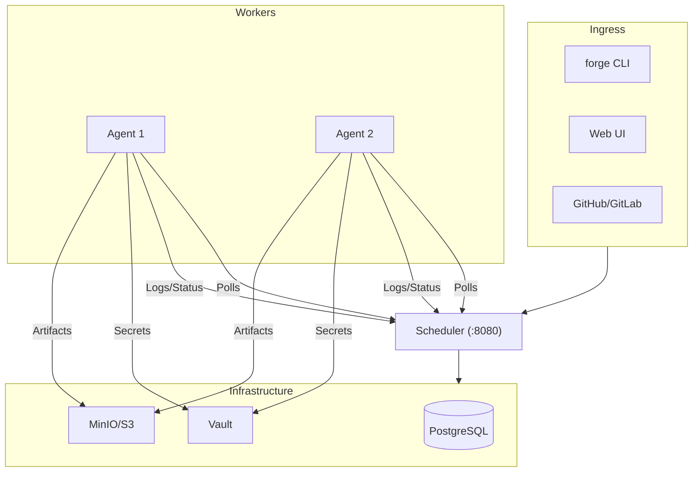

# Forge

The programmable CI/CD engine for modern teams. Forge is a container-native CI/CD system that uses Go-based logic (via generators) instead of complex YAML templating.

---

## Why Forge?

Traditional CI/CD systems rely on static YAML. When you need complex logic (dynamic matrices, monorepo change detection, cross-repo triggers), you end up with thousands of lines of unmaintainable YAML or brittle bash scripts.

**Forge changes this by making the pipeline dynamic.** You can emit new pipeline steps at runtime using any language (Python, Go, Node), allowing your CI/CD to adapt to your code, not the other way around.

---

## Core Features

- 🚀 **Dynamic Pipelines**: Emit steps at runtime based on your code's state.
- 🐳 **Container Native**: Every step runs in a clean Docker container.
- 🛠️ **Live Debugging**: SSH/Terminal directly into failing job containers from the Web UI.
- 🛡️ **Org-wide Policies**: Automatically inject security scans into every pipeline.
- 📦 **Smart Artifacts**: Built-in artifact store with automatic fan-in/fan-out.
- 📊 **Real-time UI**: Watch logs and status updates as they happen via SSE.

---

## Architecture

The **scheduler** accepts pipeline submissions, applies org policies, stores jobs in PostgreSQL, and serves the Web UI. **Agents** poll the scheduler, lease jobs, execute them in Docker containers, stream logs back in real time, and upload/download artifacts to S3-compatible storage. The browser connects **directly** to agents for debug terminal sessions — the scheduler is not in the hot path for interactive use.
