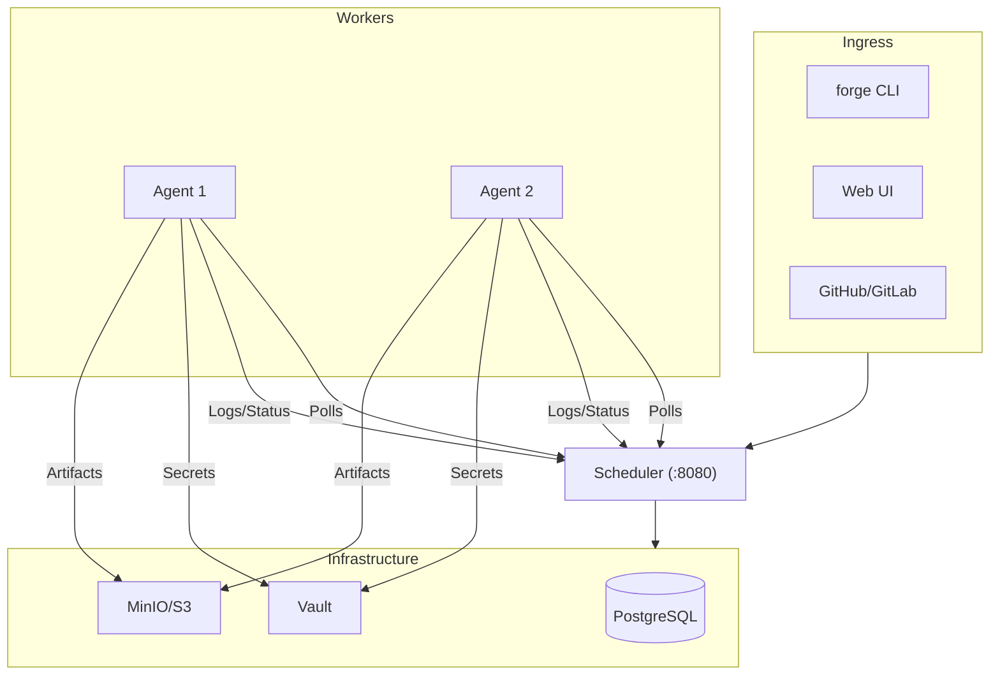

---
hide:
  - navigation
---

<div class="forge-hero" markdown>

<p class="forge-eyebrow">Code-first CI/CD</p>

# Pipeline logic belongs in your repo, not in a YAML string.

<p class="forge-lede" markdown>
Forge is a container-native CI/CD system where steps can be generated at runtime by
real scripts — Python, Go, Node, whatever you already write. Your CI logic gets
syntax highlighting, tests, and readable diffs like the rest of your code.
</p>

</div>

<div class="forge-split" markdown>

<div class="is-legacy" markdown>

<p class="forge-node">Everywhere else</p>

```yaml
- name: Detect changed services
  run: |
    CHANGED=$(git diff --name-only HEAD~1 \
      | grep "^services/" | cut -d/ -f2 | sort -u)
    for svc in $CHANGED; do
      # 80 more lines of shell, embedded in
      # a string, with no editor support
    done
```

</div>

<div class="is-forge" markdown>

<p class="forge-node">Forge</p>

```yaml
- id: detect-changes
  type: generator
  image: python:3.12-slim
  script: scripts/ci/detect-changes.py
```

```python
# scripts/ci/detect-changes.py — a real file
# you can run and unit test locally.
print(json.dumps({"steps": steps}))
```

</div>

</div>

[Run your first pipeline](Getting-Started.md){ .md-button .md-button--primary }
[Browse example pipelines](Examples.md){ .md-button }

## Start where you are

<div class="grid cards" markdown>

-   :material-rocket-launch: **Run a pipeline in five minutes**

    ---

    Clone, build, and execute a pipeline against your local Docker daemon. No
    scheduler, no database, no account.

    [Install and run →](Getting-Started.md)

-   :material-file-tree: **Write your first pipeline**

    ---

    Every step field, step type, and expression, with a worked example at the
    end.

    [Pipeline reference →](Pipeline-Reference.md)

-   :material-server-network: **Stand up a shared instance**

    ---

    Scheduler, agents, Postgres, Vault, and S3 storage — plus TLS, roles, and
    autoscaling.

    [How Forge works →](Architecture.md)

-   :material-shield-check: **Enforce standards across repos**

    ---

    Inject security scans into every pipeline from one place, and scope secrets
    per project, org, or globally.

    [Policy engine →](Policies.md)

</div>

## What Forge does differently

### Steps generated at runtime

A generator step runs your code and emits new step definitions as JSON. Build for
every platform listed in `platforms.json`? Write a script that reads it. Add a
platform, and the pipeline adapts on the next run — no YAML change.

[Testing CI logic](Testing-CI-Logic.md) covers the generator protocol and how to
preview generated steps without submitting a run.

### Pipelines that call other pipelines

A `type: pipeline` step triggers another pipeline, hands artifacts to it, and
waits for the result. Deploy logic lives in one file and is called from
everywhere.

```yaml
- id: deploy-staging
  type: pipeline
  pipeline: .forge/deploy.yml
  wait: true
  variables:
    ENVIRONMENT: staging
  artifacts_send: [build-output]
  artifacts_receive: [deployed-endpoint]
```

### A real terminal in the failed container

When a step fails, open a shell in that container, in the environment it failed
in. `cd` into the workspace and look, instead of re-running with more `echo`
lines.

{ .forge-shot }

[Debug sessions →](Debugging.md)

### Policies injected at submit time

Define Trivy scans, `govulncheck`, or anything else once at the org level. The
scheduler injects them into every pipeline at submit time — pipeline authors
don't have to know they exist, and changing the policy changes every repo.

[Policy engine →](Policies.md)

### Test splitting from real timings

Forge records per-file runtimes from the test reports your steps already emit and
rebalances shards on every run, so parallel shards finish together.

[Test splitting →](Test-Splitting.md)

## How the pieces fit



The **scheduler** accepts submissions, applies org policies, stores jobs in
PostgreSQL, and serves the Web UI. **Agents** lease jobs, run them in Docker
containers, stream logs back, and move artifacts to S3-compatible storage. All
traffic, including debug terminals, is routed through the scheduler, so agents
never need an exposed port.

[Full architecture →](Architecture.md)
